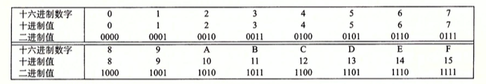

<!--more-->

<!-- toc -->

# 信息存储

现代计算机通常以 8bit 的块或者字节（byte）作为最小的可寻址内存单位，机器级程序将内存视为一个非常大的内存数组，称为 **虚拟内存**（virtual memory），内存中的每个字节由唯一 **地址**（address）标识，所有可能地址的集合称为 **虚拟地址空间**（virtual address space）。C 语言一个指针的值指向某个存储块的第一个字节的虚拟地址，C 编译器通过指针和指针的类型信息生成不同的机器级代码访问存储在指针所指向位置的值。

## 十六进制表示法

一个字节由8位组成，其在二进制表示中的值域为 $00000000_2 \sim 11111111_2 $ ，十进制值域为 $$0_{10
} \sim 255_{10}$$ ，两种符号表示法描述位模式比较不方便，因此引入了以16为基数的**十六进制**（hex）表示法，一个字节的值域用十六进制表示为：$$ 00_{16} \sim FF_{16}$$ 。C 语言以 0x开头的数字常量表示十六进制的值，如：0xFa1D37D。




### 通过上表，可以轻松完成**十六进制和二进制的转换**，如下：


二进制到十六进制的转化先以4位为一组分组再进行转换：


当值x是2的非负次幂时，即 $$x=2^n$$ ，x的二进制表示是1后面 n 个0，十六进制数字0代表4个二进制0，因此，当 n 表示 $$i+4j$$，其中 $$0{\leq}i{\leq}3$$ 时，可以把 x 写成开头为数字 1(i=0), 2(i=1), 4(i=2), 8(i=3)，后面跟着 j 个十六进制 0 的格式，如 $$2048=2^{11}$$，即$$n=11=3+4*2$$ ，即其十六进制表示为 0x800。


### 十六进制和十进制的转换，如下：

- 十进制转十六进制：反复用16 除十进制数 x，得到商 q和余数 r，即 $$x=q*16+r$$ ，之后，十六进制数将 r 作为低位数字，并反复对 q 执行这个过程，如下：


<center>得到十进制数 314156 的十六进制表示为：0x4cb2c。</center>

- 十六进制转十进制：用相应 16 的幂乘十六机制数对应的位，如 0x7ae，其相应的十进制数为：$$7*16^2+10*16+15=1967$$。


## 字数据大小

虚拟地址空间的最大大小取决于计算机的**字长**（word size），对于一个 $$\omega$$ 位的机器而言，虚拟地址范围为 $$0 \sim 2^{\omega}-1$$ ，程序最多访问 $$2_{\omega}$$个字节。

计算机和编译器支持多种不同方式编码的数字格式，以下为**基本C数据类型**的在 32bit和64bit 程序的典型值：  


## 寻址和字节顺序

跨多字节的程序对象，我们建立了两个规则：即对象的地址，以及在内存中如何排列这些字节。

如一个int类型的变量 x ，其地址 &x 为 0x100，则其4个字节被存储在 0x100, 0x101, 0x102, 0x103 4个地址上。考虑一个 $$\omega$$ 位的整数，位表示为$$[x_{\omega-1}, x_{\omega-2}, ..., x_1, x_0]$$ ，其排列方式有以下两种：

- 小端法（little endian）：在内存中按照从最低有效字节到最高有效字节存储对象


- 大端法（big endian）：在内存中按照最高有效字节到最低有效字节存储对象


字节顺序在以下几种情况会成为问题：

- 在不同机器间传递二进制数据
- 阅读调试机器级程序
- 编写规避正常的类型系统程序


以下是一段 C 代码程序，其用强制类型转换来规避类型系统，展现了在不同的机器上运行的结果：

```c
#include <stdio.h>

typedef unsigned char *byte_pointer;

void show_bytes(byte_pointer start, size_t len) {
  size_t i;
  for (i = 0; i < len; i++) {
    // %.2x 表示整数必须用至少两个数字的十六进制格式输出
    printf(" %.2x", start[i]);
  }
  printf("\n");
}

void show_int(int x) {
  show_bytes((byte_pointer) &x, sizeof(int));
}

void show_float(float x) {
  show_bytes((byte_pointer) &x, sizeof(float));
}

void show_pointer(void *x) {
  show_bytes((byte_pointer) &x, sizeof(void *));
}

// 打印示例数据对象的字节表示
void test_show_bytes(int val) {
  int ival = val;
  float fval = (float) ival;
  int *pval = &ival;
  show_int(ival);
  show_float(fval);
  show_pointer(pval);
}
```


Linux32, Window, Linux64 中，最低有效位 0x39 最先输出，说明它们是**小端法**机器，而 Sun 则相反，为**大端法**机器，指针的地址在不同机器/操作系统有不一样的值，其位数和其所使用的机器息息相关。


## 表示字符串

C 语言的字符串是以 null (其值为0) 字符结尾的字符数组。所有字符都由标准编码表示，如 ASCII 字符码。字符码和字节顺序及字大小规则无关，因而文本数据比二进制数据具有更强的平台独立性。


## 表示代码

不同的机器类型使用不同的且不兼容的指令和编码方式，因此二进制代码是不兼容的。

**计算机的一个基本概念是：从机器的角度来看，程序仅仅只是字节序列。机器没有关于原始源程序的任何信息。**


## 布尔代数（Boolean algebra）简介

二进制是计算机编码、存储和操作信息的核心，通过将逻辑值 TRUE(真)和 FALSE(假) 编码二进制值，研究逻辑推理，最简单的布尔代数是在二元集合 {0, 1} 的基础上定义的。


<center>布尔代数的运算</center>

将布尔运算扩展到位向量运算上，位向量即固定长度为 $${\omega}$$ 、由 0 和 1 组成的串。位向量运算可以定义成参数的每个对应元素之间的运算，即对于位向量 a 和 b 分别表示位$$[a_{\omega-1}, a_{\omega-2}, ..., a_0]$$ 和 $$[b_{\omega-1}, b_{\omega-2}, ... b_0]$$，即 a&b 定义为长度为 $${\omega}$$ 的位向量，其中第 i 个元素等于 $$a_i \& b_i, 0{\leq}i<{\omega}$$，类似的运算可以扩展到 **｜, ^, ~**上。

**加法逆元(additive inverse)** :对任何值 a 来说，a^a=0,因此有 $$(a^b)^a=b$$，这个属性可以引起一些有趣的结果和技巧，如交换两个数值。


位向量还可以用来表示有限集合，用位向量$$[a_{\omega-1}, … , a_1, 1_0]$$(注意$$a_{\omega-1}$$在左边，$$a_0$$在右边}) 编码任何子集 $$A\subseteq\{0, 1, …, \omega -1\}$$ ,其中 $$a_i = 1$$ 当且仅当 $$i \in A$$。例如位向量$$a\doteq[01101001]$$ 表示集合 $$A=\{0, 3, 5, 6\}$$, 位向量$$b\doteq[01010101]$$ 表示集合 $$B=\{0, 2, 4, 6\}$$,使用这种编码集合的方法，布尔运算 | 和 & 表示集合的并和交， 而 ～对应集合的补，即 a & b 得到位向量$$[01000001]$$, 而 $$A \cap B = \{0, 6\}$$。


## C 语言中的位级运算

以下是对 CHAR 数据类型表达式求值的例子：


**确定一个位级表达式最好的方法，就是将十六进制参数扩展为二进制表示并执行二进制运算，再转换回十六进制**。

位级运算一个常用技巧就是**掩码运算**，表示从一个字中选出的位的集合。如掩码 0xFF(最低8位为1)表示一个字的低位字节，位级运算$$x \& 0xFF$$ 表示生成一个由 x 低位字节组成的值，而其他字节置为 0。表达式～0将生成一个全为1的掩码，这样的写法相较于0xFFFFFFFF（对于32位机器而言）来说，其是可以移植的。  


## C 语言中的逻辑运算

以下是 C 语言逻辑运算表达式求值的例子：


逻辑运算符为$$\|, \&\&, \!$$,对应命题逻辑的 OR, AND, NOT运算。其表示结果为 TRUE(0x01) 或者 FALSE(0x00)。

逻辑运算还有个特点是，当第一个参数求值能确定表达式结果时，不会对第二个表达式进行求值，称为**短路**。如表达式 ```a&&5/a``` 可以避免被 0 除，表达式 p && *p++ 避免间接引用空指针。


## C 语言的移位运算

对于一个位表示为$$[x_{\omega-1}, x_{\omega-2}, …, x_0]$$的操作数x，C 表达式 ```x<<k``` 会生成一个值，位表示为$$[x_{\omega-k-1}, x_{\omega-k-2}, …, x_0, 0, …, 0]$$ ，即丢弃最高的 k 位，补充 k 个 0 在右端，移位量应该是一个 $$0 \sim {\omega-1}$$ 之间的值 ,且移位运算是满足结合率的，所以```x<<j<<k```等价于```(x<<j) <<k```。 

相对于左移，右移运算分为**逻辑右移**和**算术右移**。

- 逻辑右移在左端补 k 个 0，得到的结果是$$[0, …, 0, x_{\omega-1}, x_{\omega-2}, x_k]$$
- 算术右移是在左端补充 k 个最高有效位的值，得到的结果是 $$[x_{\omega-1}, …, x_{\omega-1}, x_{\omega-2}, …, x_{k}]$$，算术右移对有符号整数数据运算非常有用

下面是对一个 8 位参数 x 进行位移运算的例子：


对于有符号数，基本所有现代编译器/机器组合都是算术右移，对于无符号数，必须是逻辑位移。

JAVA 中 ```x>>k``` 表示算术右移，而 ```x>>>k``` 表示逻辑右移。

注意：当移动一个$$\omega$$ 位的值时，k 远大于 $$\omega$$ ，这时实际上的位移量为 k mod $$\omega$$。


# 整数表示

整数的数据与算术操作术语，下标$${\omega}$$表示位数：

| 符号                | 类型 | 含义             |
| ------------------- | ---- | ---------------- |
| B2$$T_{\omega}$$    | 函数 | 二进制转补码     |
| B2$$U_{\omega}$$    | 函数 | 二进制转无符号数 |
| $$U_{\omega}$$2B    | 函数 | 无符号数转二进制 |
| U2$$T_{\omega}$$    | 函数 | 无符号转补码     |
| T2$$B_{\omega}$$    | 函数 | 补码转二进制     |
| T2$$ U_{\omega} $$  | 函数 | 补码转无符号数   |
| T$$Min_{\omega}$$   | 函数 | 最小补码值       |
| T$$Max_{\omega}$$   | 函数 | 最大补码值       |
| U$$ Max_{\omega} $$ | 函数 | 最大无符号数     |
| $$+^{t}_{\omega}$$  | 操作 | 补码加法         |
| $$+^{u}_{\omega}$$  | 操作 | 无符号数加法     |
| $$*^{t}_{\omega}$$  | 操作 | 补码乘法         |
| $$*^{u}_{\omega}$$  | 操作 | 无符号数乘法     |
| $$-^{t}_{\omega}$$  | 操作 | 补码取反         |
| $$-^{u}_{\omega}$$  | 操作 | 无符号数取反     |

